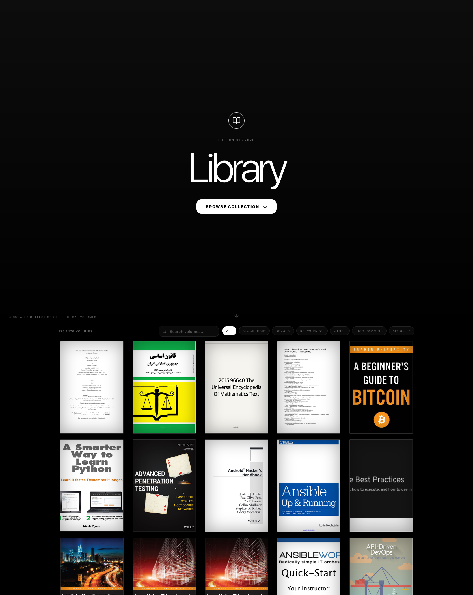

# Library

An alternative front end for [https://h4x0r.icu/library/](https://h4x0r.icu/library/) — a minimal library site for browsing downloaded books.



- The books themselves live in `books/` and are **not** in the git repo (see `.gitignore`). Run `bun run sync` to fetch them.

## Development

```sh
bun install
bun run dev
```

Copyright &copy; 2026